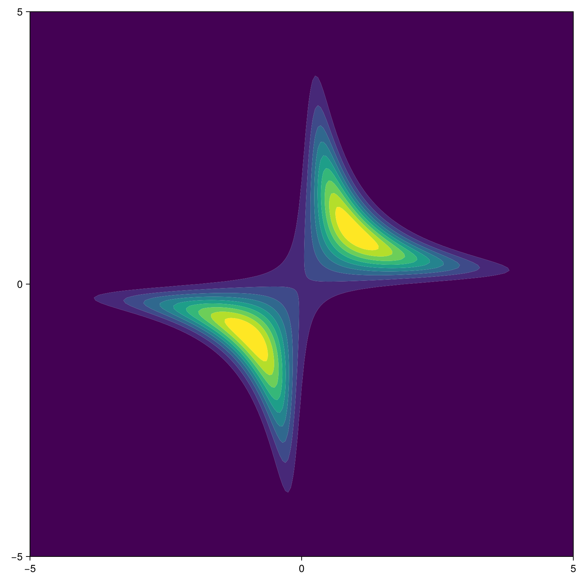

# Example: LFI

This page showcases the use of BOLFI.jl on a simple toy problem. The source code for the showcased problem is also available at [github](https://github.com/soldasim/BOLFI.jl/tree/master/examples/simple).

The example requires the following packages to be loaded.
```julia
using BOLFI
using BOSS
using Distributions
```

Additionally, we will utilize the following function for defining the priors later.
```julia
"""
Return an _approximate_ Inverse Gamma distribution
with 0.99 probability mass between `lb` and `ub.`
"""
function calc_inverse_gamma(lb, ub)
    μ = (ub + lb) / 2
    σ = (ub - lb) / 6
    a = (μ^2 / σ^2) + 2
    b = μ * ((μ^2 / σ^2) + 1)
    return InverseGamma(a, b)
end
```

## Problem Definition

In our toy problem, our goal is to infer two parameters ``x \in \mathbb{R}^2``. We defined the true _unknown_ mapping ``f_t(\theta) = g_t(\theta) = \prod\theta``.
```julia
f_(x) = x[1] * x[2]
```

_(Note that we refer to the parameters as `x` here, inteas of ``\theta``, to be consistent with the source code of BOLFI.jl.)_

The experiment observation noise deviation ``\sigma_f = 0.5`` is defined as
```julia
obs_noise_std = [0.5]
```

We have observed the single observation ``\prod\theta = 1.``.
```julia
y_obs = [1.]
```

We define the noisy simulation function ``g(x)``. The _unknown_ simulation noise deviatoin is set to ``\sigma_g = 0.001``.
```julia
function simulation(x; noise_std=0.001)
    y = f_(x) + rand(Normal(0., noise_std))
    return [y]
end
```

Then we need to define the objective function for the Gaussian processes to query data from. This function should take a vector of parameters ``\theta`` as the input, and return a vector of discrepancies ``\delta(\theta) = y(\theta) - y_o`` between the simulated (noisy) observations ``y(\theta)`` and the real observations ``y_o``.
```julia
gp_objective(x) = simulation(x) .- y_obs
```

We will limit the domain to a ``\theta \in [-5,5]^2``.
```julia
bounds = ([-5, -5], [5, 5])
```

Finally, we define the parameter prior. We may for example know, that the parameter values around zero are more realistic. In such case, we might use a normal distribution centered around zero. The parameter prior should be defined as a single multivariate distribution.
```julia
x_prior = Product(fill(
    Normal(0., 5/3),
    2, # x dimension
))
```

The true parameter posterior (which we would like to learn using the simulated observations) is shown in the image below.

| | | | | |
| --- | --- | --- | --- | --- |
| | |  | | |
| | | | | |

## Problem Hyperparameters

Now we need to define the kernel and some priors. We use very weak priors here as if we knew very little about the true objective function. See the hyperparameter section for more information about hyperparameters.

We will use the ``Matérn_{\frac{3}{2}}`` kernel.
```julia
kernel = BOSS.Matern32Kernel()
```

We define the length-scale priors so that they suppress any length scales below ``0.05`` or above ``10``. The length-scale priors should be defined as a vector of multivariate distributions, where each distribution defines the prior for different observation dimension.
```julia
λ_prior = Product(fill(
    calc_inverse_gamma(0.05, 10.),
    2, # x dimension
))

length_scale_priors = fill(
    λ_prior,
    1, # y dimension
)
```

We define the amplitude priors to suppress amplitudes below ``0.1`` or above ``20``. The amplitude priors should be defined as a vector of univariate distributions.
```julia
amp_priors = fill(
    calc_inverse_gamma(0.1, 20.),
    1, # y dimension
)
```

We define the simulation noise deviation prior to suppress any deviations below ``0.0001`` or above ``0.1``. (The true _unknown_ simulation noise deviation has been set to ``0.001``.) The noise deviation prior should be defined as a vector of univariate distributions.
```julia
noise_std_priors = fill(
    calc_inverse_gamma(0.0001, 0.1),
    1, # y dimension
)
```

## Instantiate `BolfiProblem`

Now, we can instantiate the `BolfiProblem`.
```julia
problem = BolfiProblem(X, Y;
    f = gp_objective,
    bounds,
    kernel,
    length_scale_priors,
    amp_priors,
    noise_std_priors,
    std_obs,
    x_prior,
)
```

## Running BOLFI

Before we run the BOLFI method, we need to define the methods used during the individual steps of the algorithm.

We need to define the acquisition function. The next evaluation point in each iteration is selected by maximizing this function. We will select new data by maximizing the posterior variance ``\mathbb{V}\left[ p(\theta|y_o) \right]``.
```julia
acquisition = PostVarAcq()
```

Then we need to define the algorithms used to estimate the model (hyper)parameters and maximize the acquisition. See the [BOSS.jl](https://soldasim.github.io/BOSS.jl/stable/) package for more information about available model fitters and/or acquisition maximizers.
```julia
model_fitter = OptimizationMAP(;
    algorithm = NEWUOA(),
    parallel = true,
    multistart = 200,
    rhoend = 1e-2,
)
acq_maximizer = OptimizationAM(;
    algorithm = BOBYQA(),
    parallel = true,
    multistart = 200,
    rhoend = 1e-2,
)
```

Finally, we need to defint the termination condition and we can use `BolfiOptions` to change some miscellaneous settings. (_One can for example define a custom `BolfiCallback` which is periodically called in each iteration of `bolfi!`._)
```julia
term_cond = BOSS.IterLimit(25)

options = BolfiOptions(;
    info = true,
)
```

Now, we have everything we need and we can call the main function `bolfi!`.
```julia
bolfi!(problem; acquisition, model_fitter, acq_maximizer, term_cond, options)
```

# Plots

To visualize the algorithm, use the example script in the [github repo](https://github.com/soldasim/BOLFI.jl/tree/master/examples/simple). It implements the same problem described on this page, but additionally contains a custom callback for plotting.
