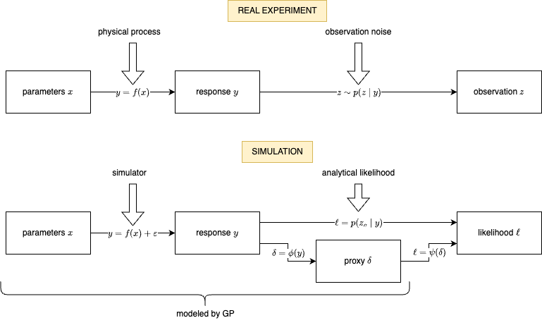

# Likelihood-Free Inference Problem

Likelihood-free inference (LFI), also known as simulation-based inference (SBI), is methodology used to solve the inverse problem in cases where the evaluation of the forward model is prohibitively expensive (and usually realized by a simulator). LFI methods aim to learn the posterior distribution of the parameters (the target of inference) instead of finding single MAP parameter estimator.

This section formally introduces the general LFI problem as considered in BOLFI.jl.

| | | | | |
| --- | --- | --- | --- | --- |
| | |  | | |
| | | | | |

## Problem Definition

The goal is to learn the posterior distribution
```math
p(x|z_o) = \frac{p(z_o|x) p(x)}{p(z_o)} \propto p(z_o|x) p(x)
```
to find which parameter values ``x`` could have produced the observation ``z_o``.

The likelihood
```math
p(z_o|x) = p(z_o|y=f(x))
```
is composed of two parts; the observation likelihood ``p(z|y)`` available in a closed form describes the uncertainty of the observation ``z_o``, and the mapping ``y = f(x)`` describes the studied system.

The user-defined prior ``p(x)`` is used to encode expert knowledge about the parameters.

## Problem Inputs

The following are considered as inputs of the problem:

- the parameter prior ``p(x)`` together with the parameter domain ``\mathcal{D} \subset \mathbb{R}^{d_x}``
- the real-world observation ``z_o \sim p(z_o|y_{true}=f(x_{true}))``
- the observation likelihood ``p(z|y)`` in a closed form
- a prohibitively expensive (noisy) blackbox simulator ``y = f(x) + \epsilon``

## Problem Output

The goal is to learn an approximation of the posterior ``p(x|z_o)``, describing not only a MAP estimate of the parameters ``x``, but the whole distribution of likely values.

# The BOLFI Method

BOLFI.jl uses the Bayesian optimization (BO) procedure, handled by the BOSS.jl package, to efficiently train an approximation of the parameter posterior while minimizing the number of required expensive simulations.

The three key parts of the method are; *the acquisition function* used to sequentially select candidate parameters for simulations, *the probabilistic surrogate model* used to obtain a cheap approximation of the simulator together with uncertainty estimates, and *the proxy variable ``\delta``* defining the exact quantitiy modeled by the surrogate model.

## The Proxy Variable

The user must decide, which exact quantities are to be modeled by the surrogate model as a function of the parameters ``x``. This choice is largely problem dependent and can have significant impact on the performance of the method.

The expensive simulator realizes the mapping ``y = f(x)``, and the observation likelihood ``p(z|y)`` provides a closed form expression for mapping the simulation output ``y`` to the likelihood value ``\ell(x) = p(z_o|y=f(x))``. In general, the surrogate model can be used to model any quantity "between" the simulation ``y`` and the likelihood value ``\ell``. This way, the model can be used to estimate the likelihood ``\ell(x)`` while avoiding the need to evaluate the expensive simulator ``f(x)``.

In general, it is not always reasonable to model the simulation outputs ``y(x)`` directly. For example, if the simulation output ``y`` has a huge dimensionality, modeling it will be inefficient. The other extreme is modeling the scalar log-likelihood ``\log \ell(x)``. This, on the other hand, often discards too much information obtained from the simulator by compressing the output into a single value.

It is upon the user to define a suitable proxy variable ``\delta = \phi(y)`` to be modeled by the surrogate model. The uncertainty of the modeled proxy variable ``\delta(x)`` is then propagated into the uncertainty in the estimate of the likelihood value ``\ell(x) = p(z_o|x)``.

Some examples of setting up BOLFI.jl to model different quantities are described below.

### Modeling the Simulation Output

To model the simulation output, one should provide the black-box simulator directly as the ``f`` function of the [`BolfiProblem`](@ref) structure, and use a suitable [`Likelihood`](@ref), which defines the whole mapping from ``y`` to ``\ell = p(z_o|y)``. For example, one may use the [`NormalLikelihood`](@ref) if the observation noise ``p(z|y)`` is assumed to be normal.

This way, BOLFI.jl will use the surrogate model to model the whole simulation output ``y \in \mathbb{R}^{d_y}``.

### Modeling the Log-Likelihood

To model the log-likelihood, one should compose the simulator with a subsequent mapping ``\phi`` into a single function ``f`` and provide it to the [`BolfiProblem`](@ref) structure. The mapping ``\phi`` should be defined as the log-pdf of the observation likelihood ``p(z|y)``. I.e. the provided function ``f`` will take the parameters ``x`` as the input, evaluate the expensive simulation ``y = f(x)``, and then map the simulation outputs ``y`` to a scalar log-likelihood value ``\log\ell = p(z_o|y)``. In this case, the [`ExpLikelihood`](@ref) should be provided as the [`Likelihood`](@ref), which then only exponentiates the log-likelihood.

This way, BOLFI.jl will use the surrogate model to model the scalar log-likelihood ``\log p(z_o|x)``.

### Modeling Arbitrary Proxy Variable

To model any arbitrary proxy variable ``\delta`` by the surrogate model, do the following. Define a mapping ``\phi``, which maps the simulation outputs ``y`` to your proxy variable ``\delta`` by realizing *a part of* the observation likelihood pdf ``p(z_o|y)``. Then define a second mapping ``\psi``, such that ``(\psi \circ \phi)(y) = p(z_o|y)``. In other words, the mapping ``\psi`` realized the *remaining part* of the observation likelihood pdf.

Compose the expensive simulator ``y = f(x)`` and the mapping ``\psi`` into a single function `f` and provide it to the [`BolfiProblem`](@ref). Define a custom [`Likelihood`](@ref), which realizes the remaining mapping ``\psi`` and provide it to the [`BolfiProblem`](@ref) as the `likelihood`.

## Surrogate Model

The probabilistic surrogate model is used to approximate the expensive simulator based on the data from previous simulations. It models the proxy variable ``\delta`` as a function of the parameters ``x``. It provides a posterior predictive distribution ``p(\delta|x)``, which describes the current estimate of ``\delta`` for the given ``x`` together with the uncertainty in that estimate.

The default choice for the surrogate model is the `GaussianProcess` model.

## Acquisition Function

The acquisition function ``\alpha: \mathbb{R}^{d_x} \rightarrow \mathbb{R}`` is maximized in each iteration in order to select the most promising candidate parameters
```math
x \in \arg\max \alpha(x)
```
for the next simulation. The current surrogate model is used to calculate the acquisition values ``\alpha(x)``, thus avoiding the need for the expensive simulator when evaluating the acquisition function.

The most basic [`BolfiAcquisition`](@ref) is the [`PostVarAcq`](@ref), which selects the point of maximal variance of the current posterior approximation as the next evalation point, effectively exploring the areas with the highest model uncertainty.
